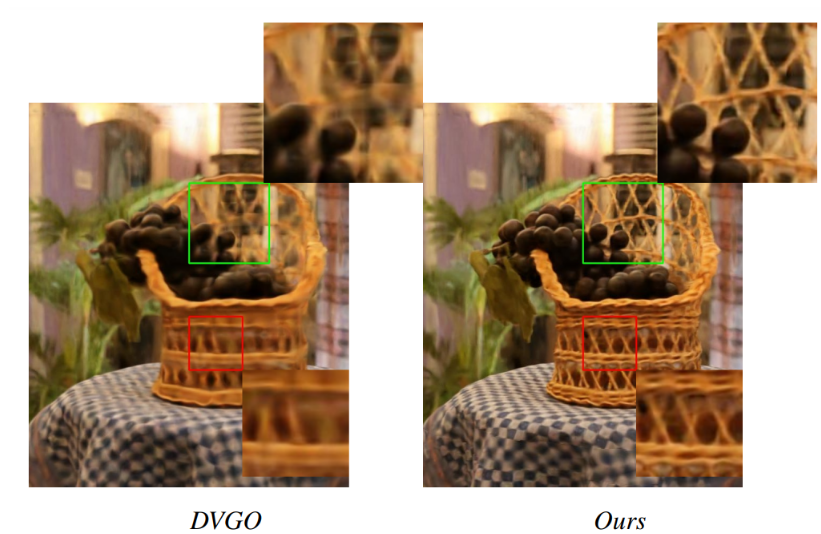
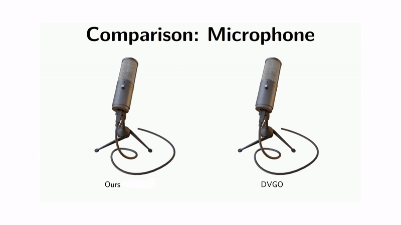

# Adaptive Grids for Neural Scene Representation

Official implementation of **Adaptive Grids for Neural Scene Representation** presented at **VMV 2024**.  
**[Project Page](https://vcai.mpi-inf.mpg.de/projects/agrids/)** | **[Paper](https://pure.mpg.de/rest/items/item_3624536/component/file_3624537/content)**

  

  

---

## Installation

Clone the repository and install the required dependencies:

```bash
git clone https://github.com/yourusername/yourrepository.git
cd yourrepository
pip install -r requirements.txt
```

## Training

Follow these steps to train the model:

1. **Prepare the Dataset**: Ensure your dataset is organized as required by the project.
   
2. **Run Training**: Use the following command to start training:

    ```bash
    python train.py --config configs/your_config.yaml
    ```

    Replace `your_config.yaml` with the appropriate configuration file.

## Usage

### Inference

To run inference with a trained model, use:

```bash
python infer.py --checkpoint path/to/your/checkpoint
```

## Evaluation

To evaluate the model's performance on a specific dataset, use:

```bash
python evaluate.py --dataset path/to/your/dataset
```

## Acknowledgements

This codebase is based on the [DirectVoxGO (DVGO)](https://github.com/sunset1995/DirectVoxGO) implementation by Sunset1995. We thank the authors for their contributions and open-sourcing their work.

---

## Citation

If you find this work useful, please consider citing:

```bibtex
@inproceedings{pajoum2024adaptive,
  title={Adaptive Grids for Neural Scene Representation},
  author={Pajoum, Barbod and Fox, Gereon and Elgharib, Mohamed and Habermann, Marc and Theobalt, Christian},
  booktitle={International Symposium on Vision, Modeling, and Visualization},
  year={2024},
  organization={Eurographics Association}
}
```

## License

This project is licensed under the GNU General Public License v3.0. See the [LICENSE](LICENSE) file for details.

